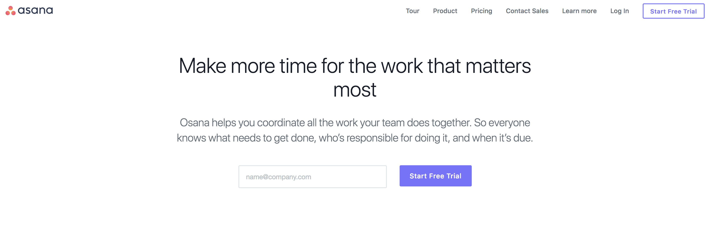
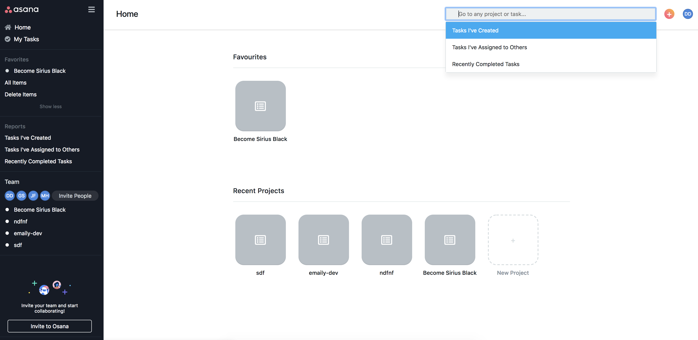
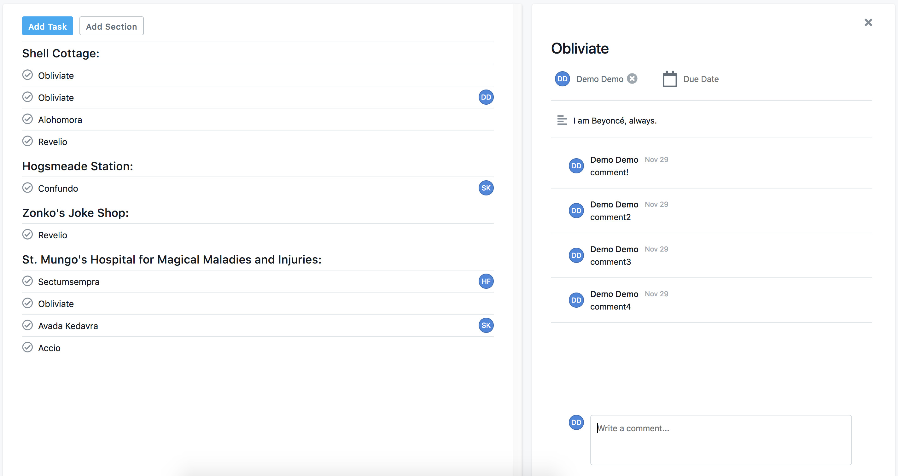
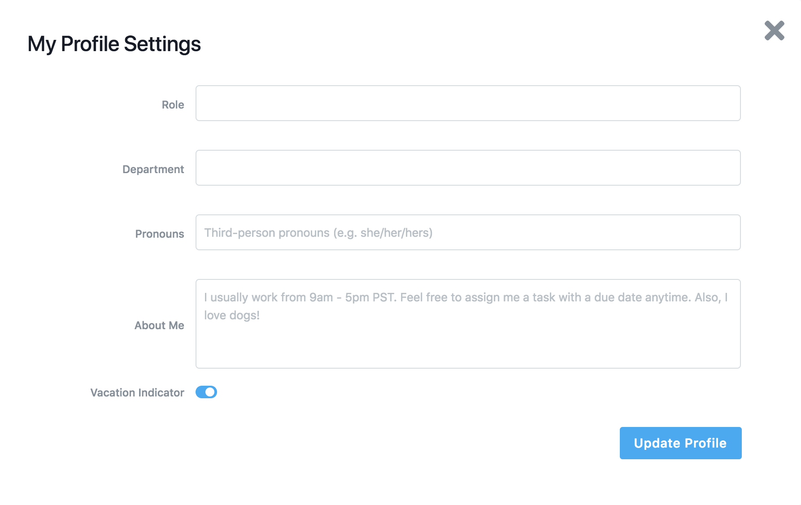

# Osana
[Live Link](http://www.osana.herokuapp.com/)

Osana is a full stack, single-page application inspired by [Asana](http://www.asana.com/).

## Languages and Libraries
* JavaScript
* React.js
* Redux
* Ruby
* Ruby on Rails
* PostgreSQL
* HTML5 + CSS3

## Features
* Create an account
* Log in / Log out
* Update profile information
* Create projects, sections, favourites, comments
* Create, edit tasks
* Search for projects

### Homepage

The home page allows the user to sign up and log in. There is a demo user log in button if the user does not want to create an account.

### Projects Page

The projects page is for displaying all the projects of user's current team as well as the user's favourite projects on the team. The side nav bar also features some of the similar information. The top nav bar features a search function which allows user to look up different projects.

### Tasks Page

The tasks page features both sections and tasks. User may click the checkmark on the left side of task to mark task completed. User may click on any task to open up the comment box which also features ability to add in due date and assigned user.

### User Profile 

User can customize their own profile.

## Possible future features
- Add in likes for comments
- Make tasks and sections draggable
